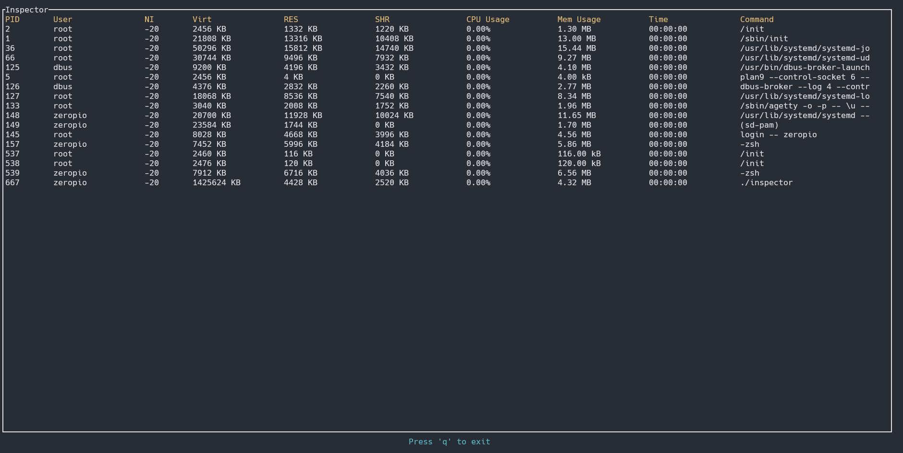

# Inspector

Inspector is a command-line process monitoring tool for Linux, built using Rust. It provides real-time visibility into system processes, displaying detailed information such as PID, user, CPU, and memory usage.

## ToDo
- [ ] Better TUI
  - [ ] Order by columns
  - [ ] Color
  - [ ] Add graph
  - [ ] Search/Filter functionality
  - [ ] Better help
  - [ ] Themes (?)
- [ ] More monitoring
  - [ ] Network usage
  - [ ] I/O
  - [ ] Better uptime
- [ ] System summary
- [ ] Logging monitoring
- [ ] Process management
- [ ] Better performance

## Overview



## Building the Project
To build the project, you will need [Rust](https://www.rust-lang.org/tools/install) and Cargo installed on your system.

Navigate to the root of the project directory and run the following command to compile the project in release mode:

```sh
cargo build --package inspector --bin inspector --release
```

This command tells Cargo to compile the inspector package with optimizations suitable for a release.

## Running the Application
After building the project, you can run the inspector binary directly from the command line:
```
./target/release/inspector
```

## Features
- Real-time process monitoring
- Display of essential process metrics:
  - PID
  - User
  - Nice value
  - Virtual memory usage (Virt)
  - Resident Set Size (RES)
  - Shared memory size (SHR)
  - CPU Usage
  - Memory Usage
  - Execution time
  - Command line of the process
  
## Controls
`q`: Quit the application

## Contributing
Contributions to Inspector are welcome! Feel free to open issues or submit pull requests on the project's repository.

## License
This project is licensed under the GPL 3.0 License - see the [LICENSE](https://github.com/zeropio/inspector/blob/main/LICENSE.txt) file for details.

## Acknowledgements
- This project uses the tui-rs library for creating the terminal user interface.
- System information is obtained using the `/proc` filesystem on Linux.